# MiID Architecture

이 문서는 MiID 분산 신원 인증 시스템의 아키텍처를 설명합니다.

## 액터

| 액터 | 설명 |
|------|------|
| User | 최종 사용자. 승인/거부 의사결정 |
| Browser | 서비스 UI 렌더링, 세션 쿠키(sid) 보관 |
| Service Frontend | 로그인 UI, 대기 상태 표시, SSE 수신 |
| Service Backend | Challenge 요청, Gateway SSE 구독, Token exchange, 서비스 세션 발급 |
| Auth Gateway | Challenge/Approval/Token/Session 상태 관리, SSE 이벤트 발행 |
| Auth Wallet | Electron 데스크톱 앱. 로컬 키 보관, 사용자 승인, 자동 승인 정책 관리 |

## 1) High-Level Component Diagram

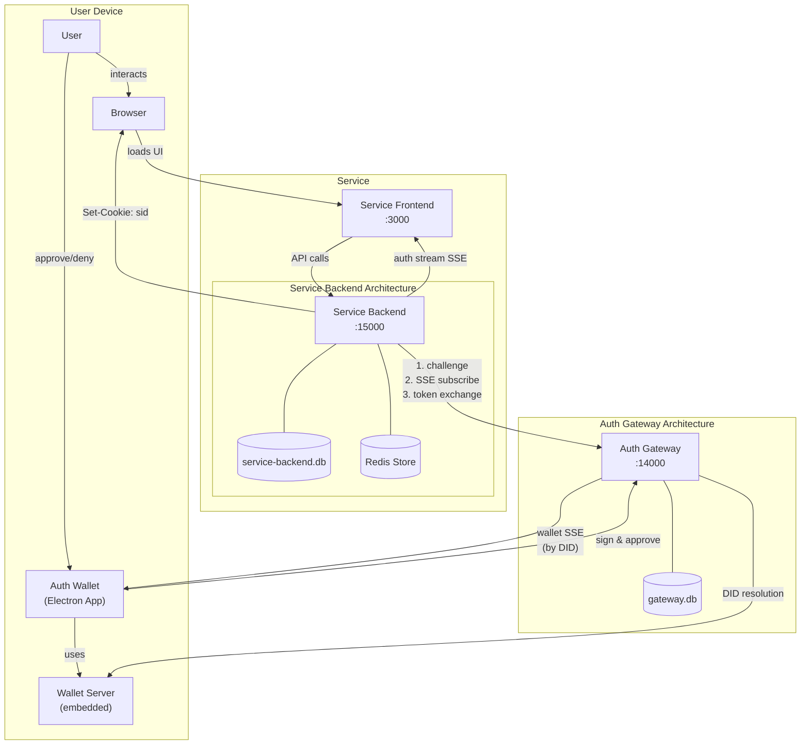

## 2) Data Flow Overview

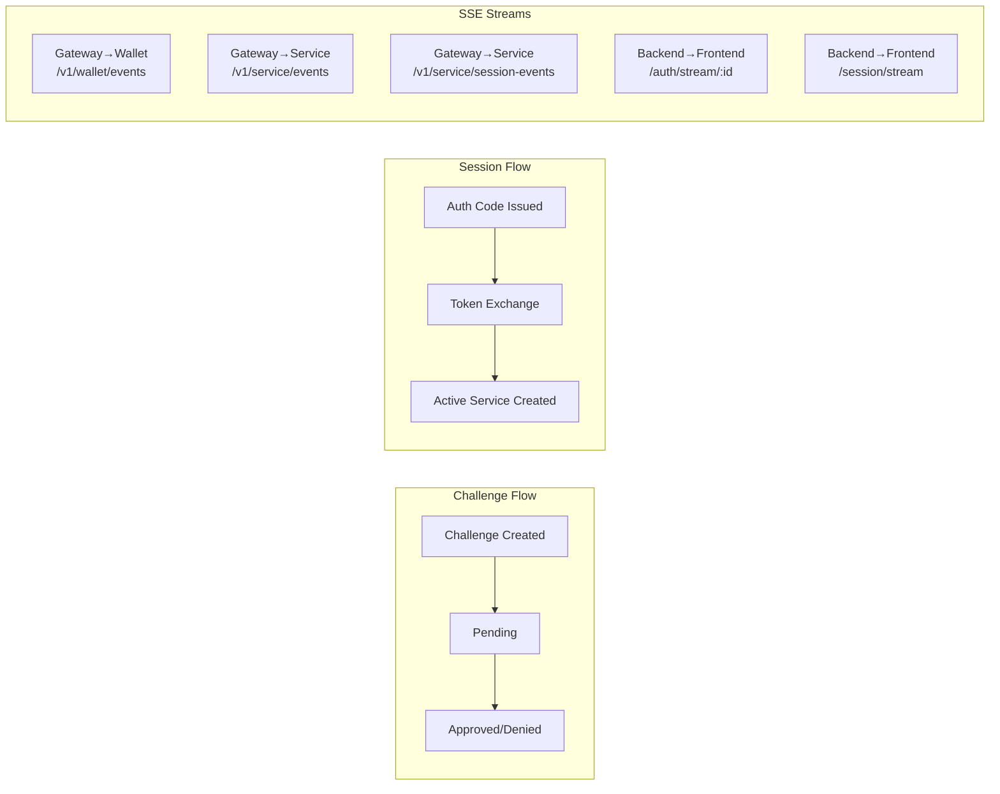

## 3) End-to-End Login Sequence

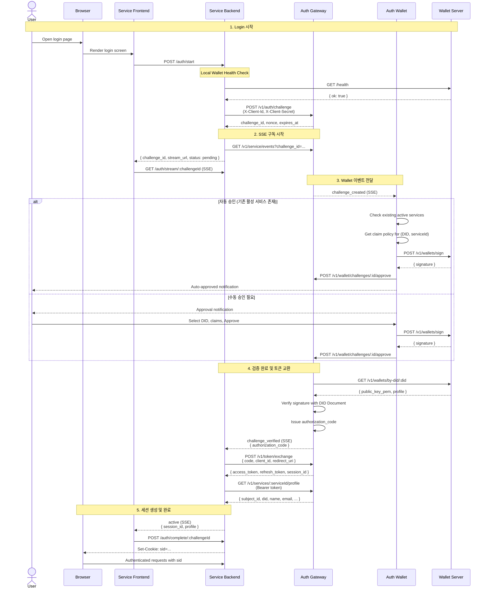

## 4) Auto-Approval Flow

Wallet은 동일 서비스에 기존 active 세션이 있을 때 자동 승인을 수행합니다.

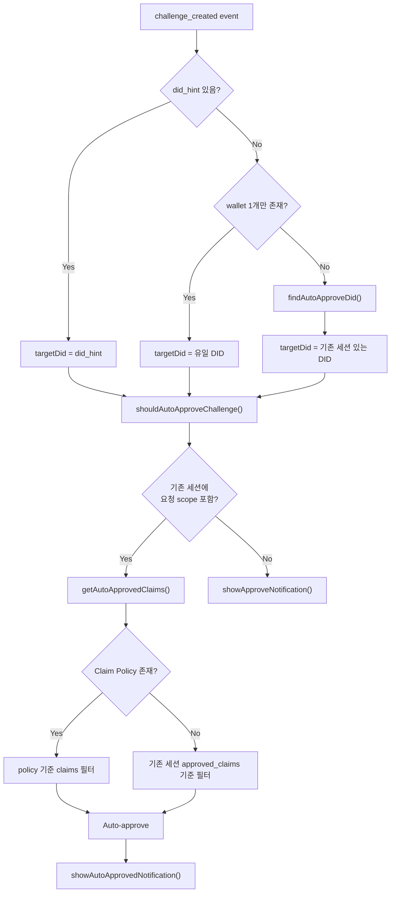

## 5) State Machine

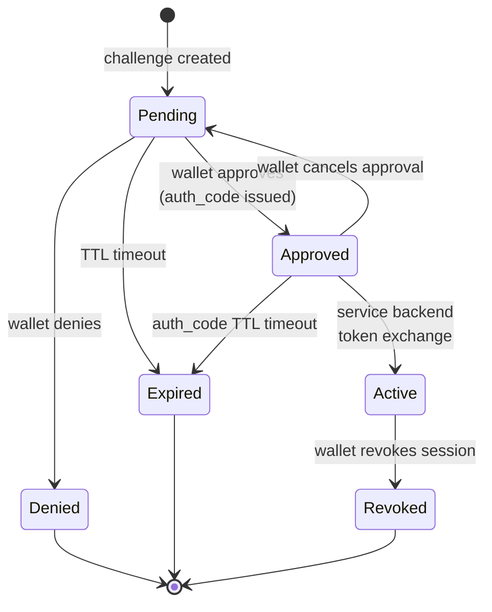

## 6) SSE Event Streams

### Gateway → Wallet (`/v1/wallet/events?did=`)

| Event | Trigger | Payload |
|-------|---------|---------|
| `challenge_created` | 새 challenge 생성 | challenge_id, service_id, scopes, requested_claims |
| `challenge_approved` | 본인 승인 완료 | challenge_id, authorization_code |
| `challenge_denied` | 본인 거부 | challenge_id |
| `session_created` | 세션 생성 | session_id, service_id, scope |
| `session_revoked` | 세션 revoke | session_id, service_id |
| `approved_cancelled` | 승인 취소 | challenge_id, authorization_code |
| `login_reused` | 세션 재사용 로그인 | service_id, scopes |

### Gateway → Service Backend (`/v1/service/events?challenge_id=`)

| Event | Payload |
|-------|---------|
| `challenge_verified` | authorization_code, service_id, client_id |
| `challenge_denied` | challenge_id, service_id |
| `challenge_expired` | challenge_id |

### Gateway → Service Backend (`/v1/service/session-events`)

| Event | Payload |
|-------|---------|
| `session_created` | session_id, service_id, subject_id, did |
| `session_revoked` | session_id, service_id, subject_id, did |

### Service Backend → Frontend (`/auth/stream/:challengeId`)

| Event | Payload |
|-------|---------|
| `snapshot` | 현재 상태 스냅샷 |
| `approved` | authorization_code, verified_at |
| `active` | session_id, profile |
| `denied` | challenge_id |
| `expired` | challenge_id |
| `error` | error message |

### Service Backend → Frontend (`/session/stream`)

| Event | Payload |
|-------|---------|
| `force_logout` | reason: "revoked", session_id |

## 7) Component Architecture

### Auth Wallet (Electron App)

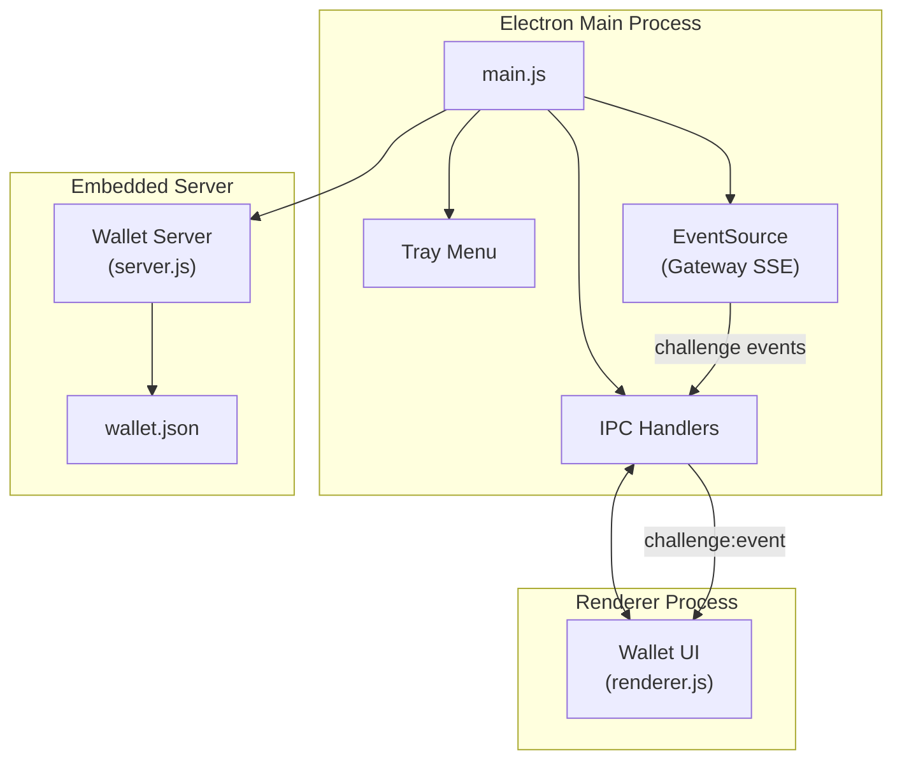

### Auth Gateway

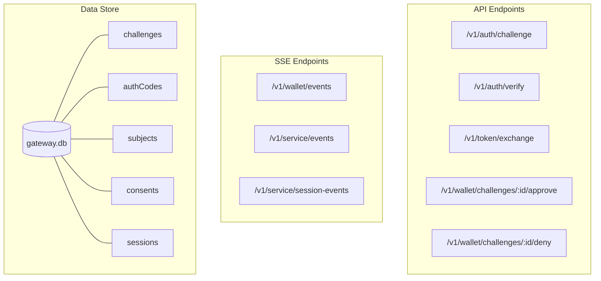

### Service Backend

Service Backend는 서비스 설정 및 클라이언트 정보를 SQLite에 저장하고, 런타임 세션 정보를 Redis에 캐싱합니다.

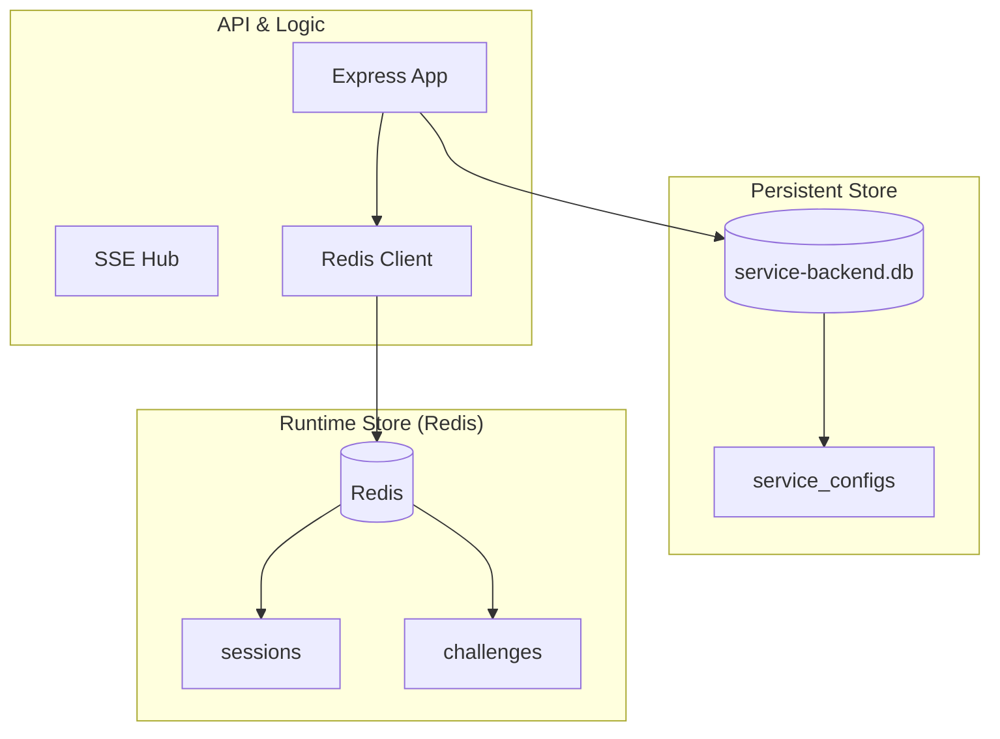

### Service Client Authentication

Service Backend는 Gateway API 호출 시 클라이언트 인증이 필요합니다.

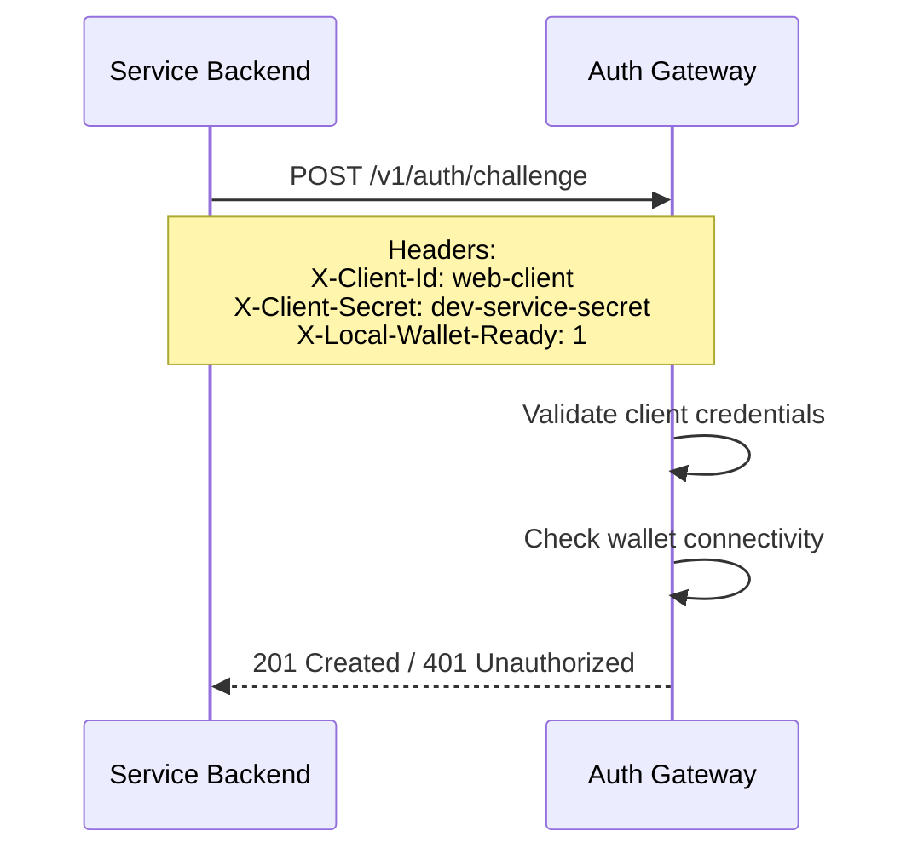

## 9) Claim Policy System

Wallet은 서비스별로 어떤 claims을 자동 공유할지 정책을 저장합니다.

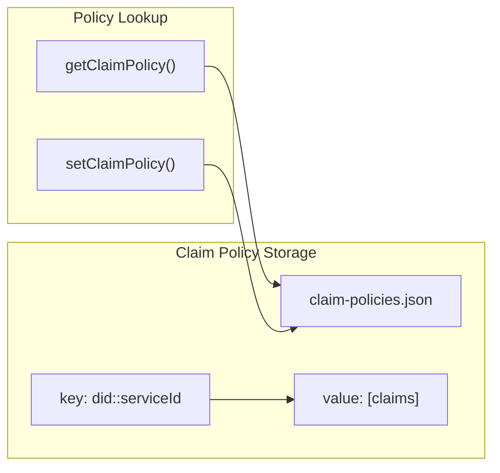

**정책 적용 우선순위:**
1. 저장된 claim policy (did + serviceId)
2. 기존 세션의 approved_claims
3. 요청된 모든 claims (기본값)

## 10) Security Notes

- **서명**: Wallet 로컬 Ed25519 키로만 수행
- **승인 없이 finalize 불가**: `Approved` 상태에서만 token exchange 가능
- **서비스 로그인 판정**: `Active session + valid sid`
- **브라우저**: `sid`만 유지, 민감 토큰은 서비스 백엔드 저장
- **서비스 인증**: X-Client-Id + X-Client-Secret 헤더
- **로컬 월렛 필수**: LOCAL_WALLET_REQUIRED 환경 변수로 제어
- **DID Method**: `did:miid` (데모용 로컬 방식)

## 11) Port Configuration

| Component | Default Port | Environment Variable |
|-----------|--------------|---------------------|
| Auth Gateway | 14000 | GATEWAY_PORT |
| Service Backend | 15000 | PORT |
| Wallet Server | 17000 | WALLET_PORT |
| Service Frontend | 3000 | (proxy via server.js) |

## 12) Environment Variables

### Gateway
- `GATEWAY_PORT`: Gateway 포트 (기본 14000)
- `GATEWAY_DB_FILE`: SQLite 데이터베이스 경로 (data/gateway.db)
- `DEBUG_AUTH`: 디버그 로그 활성화
- `SERVICE_CLIENT_ID`, `SERVICE_CLIENT_SECRET`: 서비스 클라이언트 인증
- `REQUIRE_WALLET_APPROVAL_FOR_REUSE`: 세션 재사용 시 월렛 승인 필요 여부
- `LOCAL_WALLET_REQUIRED`: 로컬 월렛 연결 필수 여부

### Wallet
- `WALLET_PORT`: Wallet 서버 포트 (기본 17000)
- `GATEWAY_URL`: Gateway URL
- `MIID_DATA_DIR`: 데이터 저장 경로
- `MIID_POPUP_ON_CHALLENGE`: challenge 시 윈도우 팝업 여부
- `MIID_HIDE_DOCK`: macOS dock 아이콘 숨김

### Service Backend
- `PORT`: Backend 포트 (기본 15000)
- `GATEWAY_URL`: Gateway URL
- `LOCAL_WALLET_URL`: 로컬 월렛 URL
- `LOCAL_WALLET_REQUIRED`: 로컬 월렛 필수 여부
- `REDIS_URL`: Redis 저장소 URL (기본 redis://127.0.0.1:6379)
- `SERVICE_DB_FILE`: 서비스 설정 DB 경로 (data/service-backend.db)
- `CLIENT_ID`, `CLIENT_SECRET`: Gateway 인증 정보 (초기값)
- `SERVICE_ID`: 서비스 식별자 (초기값)
- `SERVICE_AUTO_FINALIZE`: 자동 finalize 여부
- `REQUESTED_CLAIMS`: 요청할 claims (쉼표 구분, 초기값)

**동적 설정 변수** (런타임에 `/service/manage` API로 변경 가능):
- `CURRENT_SERVICE_ID`: 현재 사용 중인 서비스 ID
- `CURRENT_CLIENT_ID`: 현재 사용 중인 클라이언트 ID
- `DYNAMIC_REQUESTED_CLAIMS`: 현재 요청할 claims 목록

## 13) Frontend Profile Rendering

프론트엔드는 프로필 정보를 동적으로 렌더링합니다.

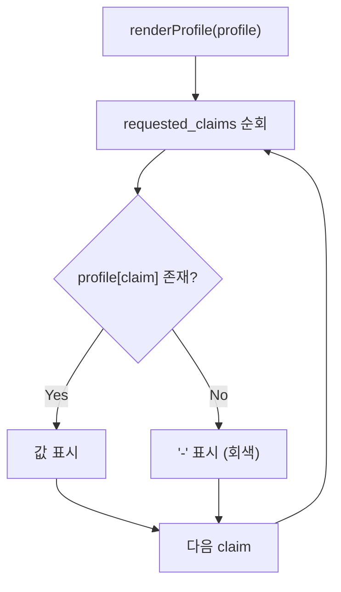

**렌더링 규칙:**
1. `requested_claims` 배열의 모든 항목을 표시
2. `approved_claims`에 포함되고 값이 있으면 정상 표시
3. 승인되지 않았거나 값이 없으면 `-`로 표시 (회색)
4. 고정 필드: Service ID, Risk Level은 항상 표시

**예시 응답:**
```json
{
  "requested_claims": ["name", "email", "phone"],
  "approved_claims": ["name", "email"],
  "name": "홍길동",
  "email": "user@example.com"
}
```

**렌더링 결과:**
| Field | Value | Style |
|-------|-------|-------|
| name | 홍길동 | 정상 |
| email | user@example.com | 정상 |
| phone | - | 회색 |

## 14) Dynamic Service Configuration

서비스 백엔드는 런타임에 서비스 설정을 변경할 수 있습니다.

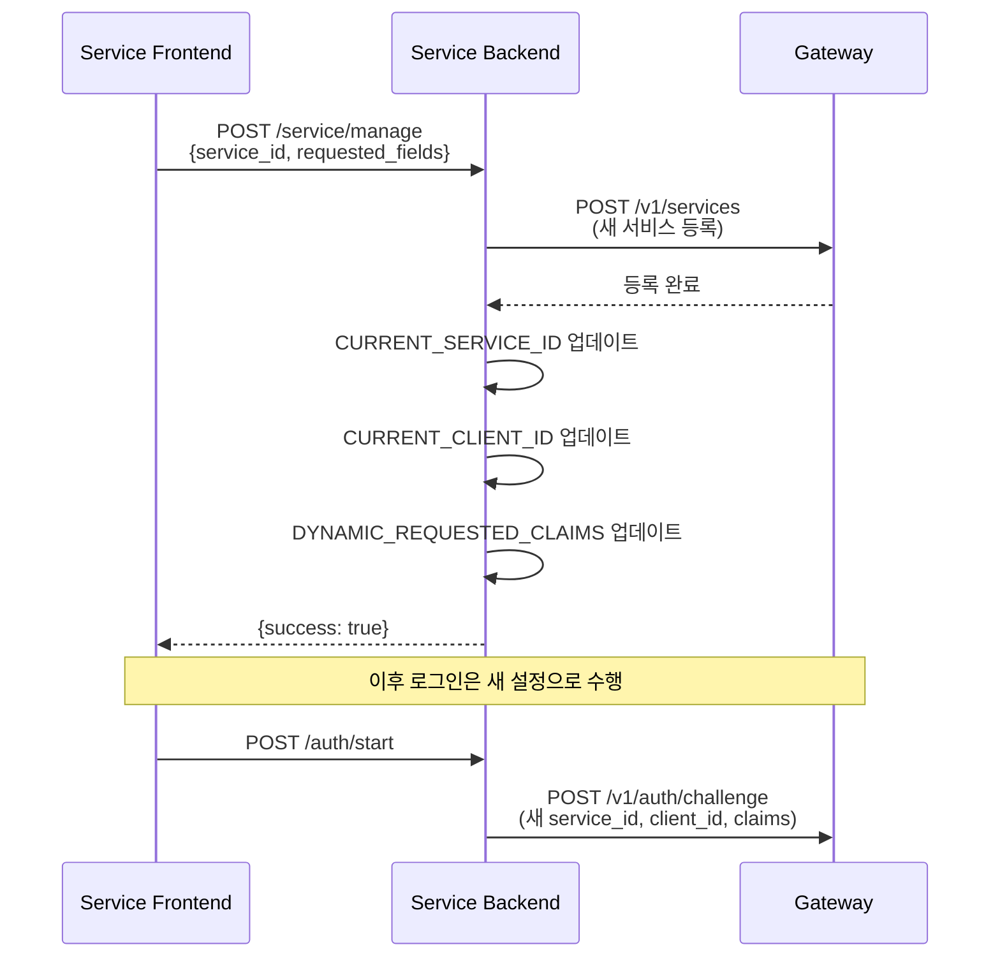

**주의사항:**
- EventSource 연결 시에도 `CURRENT_CLIENT_ID`를 사용하여 인증
- 서비스 설정 변경 후 기존 EventSource 연결은 유지됨 (재연결 시 새 설정 적용)

## TODO

- [ ] 서비스 식별자(`service_id`)를 `service DID` 기반으로 전환
- [ ] 멀티테넌시 격리 (tenant 경계 기반 subject/session/consent 분리)
- [ ] 서비스 인증 강화 (`private_key_jwt` 또는 mTLS, 키 회전)
- [ ] DID resolver/신뢰앵커 기반 공개키 검증 (`did:miid` 보강)
- [ ] 정책 엔진 분리 (서비스별 승인 재사용 TTL, step-up, 리스크 룰)
- [ ] 이벤트 전달 신뢰성 강화 (SSE 재연/복구 또는 큐 기반 보장)
- [ ] 감사/모니터링 체계 (승인/거절/revoke 추적, 경보, 보관 정책)
