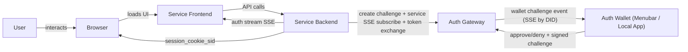
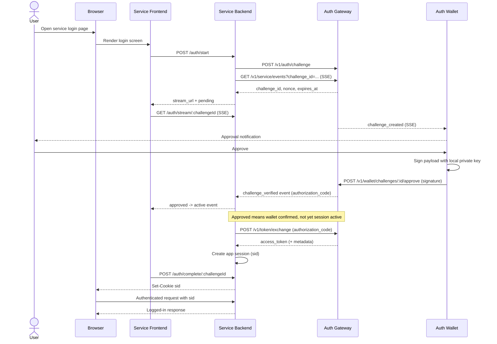
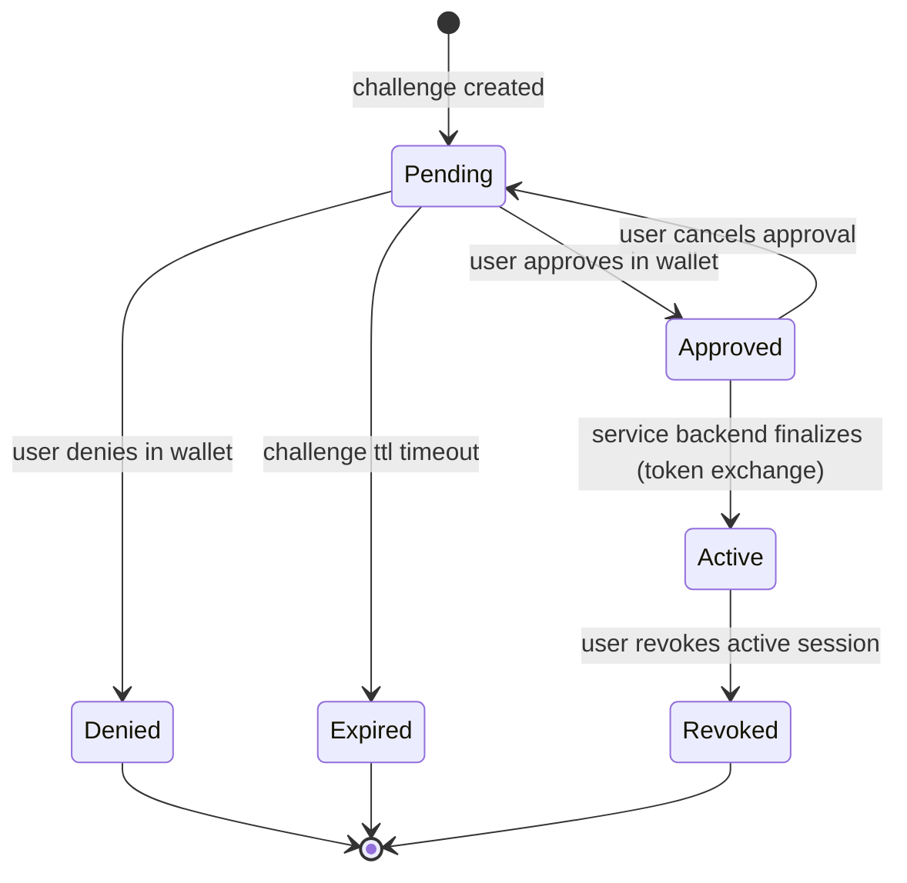

# MiID Architecture

이 문서는 다음 액터를 기준으로 전체 인증 아키텍처를 설명합니다.
- User
- Browser
- Service Frontend
- Service Backend
- Auth Gateway
- Auth Wallet

## 1) High-Level Component Diagram

## 2) End-to-End Login Sequence

## 3) State Model (User Approval to Service Session)

## 4) Responsibility by Actor

- User
  - 최종 승인/거부 의사결정
  - Active 세션 revoke 실행
- Browser
  - 서비스 UI와 세션 쿠키(`sid`) 보관
  - 토큰/개인키는 직접 보관하지 않음
- Service Frontend
  - 로그인 UI, 승인 대기 상태 표시
  - Service Backend SSE(`/auth/stream/:challengeId`) 수신
- Service Backend
  - challenge 요청, gateway SSE 구독, finalize(token exchange), 서비스 세션 발급
- Auth Gateway
  - challenge/approval/token exchange/세션 상태 관리
  - wallet용 SSE(`/v1/wallet/events`) + service용 SSE(`/v1/service/events`) 제공
- Auth Wallet
  - 로컬 키 보관, 사용자 승인 시 서명
  - Pending/Approved/Active 상태 UI 제공

## 5) Security Notes

- 서명은 wallet 로컬 키로만 수행
- 승인 없이 finalize 불가 (`Approved` 필요)
- 서비스 로그인 판정 기준은 `Active session + valid sid`
- 브라우저는 `sid`만 유지, 민감 토큰은 서비스 백엔드 저장 권장
- 현재 구현은 VC/VP 미사용 (DID 소유 증명 + 사용자 승인 기반)
- `did:miid`는 데모용 로컬 방식이며 공인 DID resolver 검증은 아직 미적용
